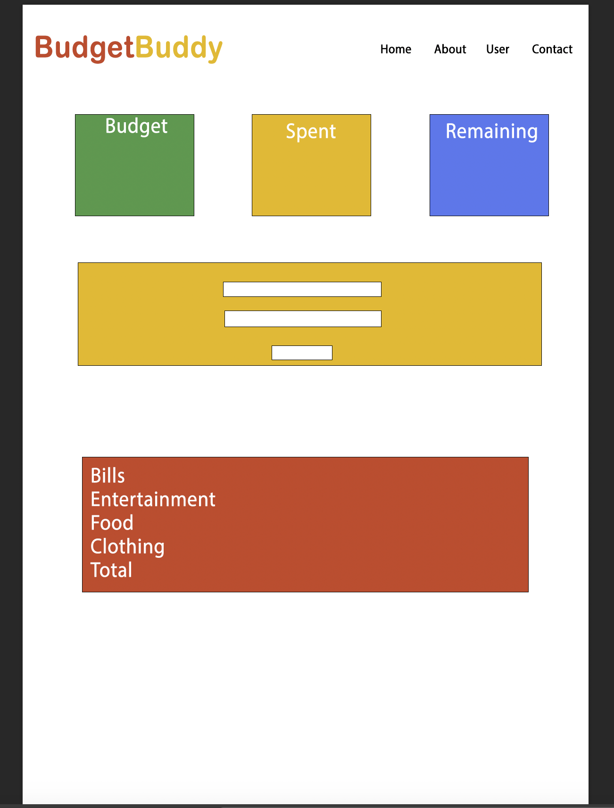

# BudgetBuddy

## Project Contributors

- Lance Watson

* Ralph Bankston

- Jazmine Miller

- Omar Mahmoud

## Technologies Used

-HTML

-CSS

-Javacript

-Chart.js

-Git

## Description

Budget buddy is a weekly budget tracking application. Budget buddy allows you to set a weekly budget. If you overspend, you are notified by the application. The application will also track your expenses by category to inform you on what you spend your money on. And how much you spent. Budget buddy also shows you a real time pie chart to make it easy to understand what is going on with your spending habits.

## Colors

- #4185f4
- #e94335
- #fbbc08ß
- #35a754

## Logo

## Mock Up

## Setup/Installation Requirements

- Clone this repository to your desktop
- Navigate to the top level of the directory
- Open index.html in your browser

## Project Repository

This site was built using [BudgetBuddy ](https://github.com/omareo22/BudgetBuddy)

## Known Bugs

- You tell me
